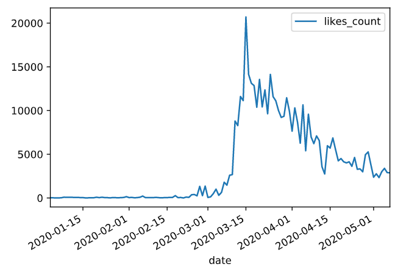

## *Strona w budowie!* -- Wpływ koronawirusa na zachowanie Polaków -- *Strona w budowie!*

<!-- Jesteśmy grupą studentów, których zainteresował wpływ aktualnie panującej pandemii i nałożonych obostrzeń na społeczeństwo. -->
Jak pandemia wpływa na pewne aspekty życia społecznego? Czy i na którym etapie sytuacja się unormowała? Jakie wydarzenia i działania rządu mają wpływ na zachowania Polaków?

## Czy policja ma mniej pracy?

Państwo Polskie w odpowiedzi na obecną sytuację wprowadziło ograniczenia wpływające na codzienne życie społeczeństwa. Wszystkie media przekazywały apele o pozostanie w domach i ograniczenie przemieszczania się.
W obecnej sytuacji policji otrzymał kolejne obowiązki. Czy może to być przyczyną zmian w statystykach?
<!-- Czy służby oddelegowane np. do kontroli osób podjętych kwarantannie -->

---

## Jak zmieniła się sytuacja na drogach?

Jak wyglądają statystyki policyjne w kontekście przemieszczania się? Na szczególną uwagę zasługują dane z czasu, gdy wprowadzano pierwsze obostrzenia.

Jak sytuacja zmieniała się na przestrzeni kolejnych tygodni? Możemy przeanalizować zmiany w zachowaniu społeczeństwa w porównaniu z statystykami z poprzednich lat.
Podobnie jak w przypadku interwencji - widoczny jest spadek wraz z wprowadzaniem obostrzeń.

---

---

---

<!-- ## Czy praca dziennikarzy w kontekście wypadków pozostała taka sama?

 -->

## Co z zachowaniem w mediach społecznościowych?

Czy przymus siedzenia w domu wpłynął na zwiększenie aktywności profili rządowych? Wszystko wskazuje na to, że częstotliwość publikacji wpisów wzrosła w najbardziej burzliwym czasie.
Można również zaobserwować zmiany w zachowaniu użytkowników - wzrosło zainteresowanie wpisami rządowymi. Największy pik zainteresowania przypada na dzień zamknięcia granic Polski.

Profil Ministerstwa Zdrowia [@MZ_GOV_PL](https://twitter.com/MZ_GOV_PL)

<!-- 

    
    

 -->

<!-- todo -->
<!-- Dla porównania profil Ministerstwa Spraw Wewnętrznych [@MSWiA_GOV_PL](https://twitter.com/MSWiA_GOV_PL)

 -->

<!-- ## tmp

 -->

## Chcesz wiedzieć więcej?

Nasz zespół może udostępnić dane lub przygotowane wizualizacje - zapraszamy do kontaktu.
<!-- todo podać mail -->

## O projekcie

Analiza powstała w ramach projektu studenckiego.
<!-- todo więcej info ? -->

